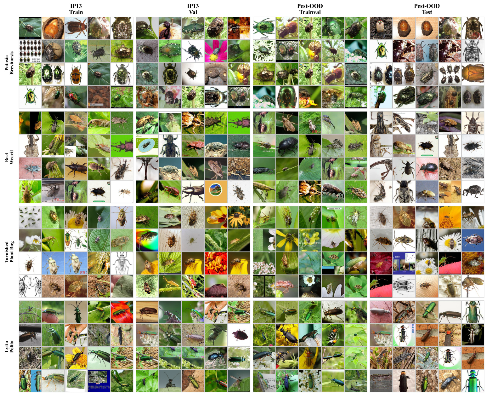

# Pest Recognition Dataset for Causal and OOD Learning

## 📌 Overview

This repository provides a publicly available pest recognition dataset used in our paper:

> **Causal-inspired learning-based method for unbiased pest recognition**
> *Expert Systems with Applications*, 2026.

The dataset is designed to support **unbiased pest recognition**, **domain generalization**, and **out-of-distribution (OOD) evaluation**.
It contains a **source domain dataset** and a **target OOD dataset**, both covering the same set of pest categories but collected under different conditions.

---

## 🐛 Dataset Description

The dataset consists of two parts:

* **IP102-13**: Source domain dataset derived from IP102, used for training and in-distribution evaluation.
* **Pest-OOD**: Target domain dataset constructed for out-of-distribution testing, with domain shifts such as background, illumination, and capture conditions.

Both datasets contain **13 pest categories**.

### 📊 Dataset Statistics

| Dataset  | Domain Type  | #Classes | #Train | #Val   | #Total |
| -------- | ------------ | -------- | ------ | ------ | ------ |
| IP102-13 | Source (ID)  | 13       | 5,379  | 3,594† | 8,973  |
| Pest-OOD | Target (OOD) | 13       | 5,462  | 2,688  | 8,150  |

† Includes original validation (898) and test (2,696) splits.

The following figure shows the class-wise sample distribution of the source (IP102-13) and target (Pest-OOD) datasets.


---

## 📂 Directory Structure

```text
dataset/
├── IP102-13/
│   ├── train/
│   ├── val/
│   └── test/
├── Pest-OOD/
│   ├── train/
│   └── val/
└── class_list.txt
```

Each subfolder is organized by **class labels**, and images are stored in standard formats (e.g., JPG, PNG).

---

## 🎯 Tasks and Use Cases

This dataset can be used for:

* Pest image classification
* Domain generalization
* Out-of-distribution (OOD) recognition
* Causal representation learning
* Bias mitigation in agricultural vision tasks

---

## 🚀 Usage

You can load the dataset using standard image classification pipelines (e.g., PyTorch `ImageFolder`).

```python
from torchvision.datasets import ImageFolder

dataset = ImageFolder(root="dataset/IP102-13/train")
```

---

## 📄 Related Paper

If you use this dataset, please cite our paper:

```bibtex
@article{liu2026causal,
  title={Causal-inspired learning-based method for unbiased pest recognition},
  author={Liu, Zhaoting and Jin, Ji and Zhang, Yanming and Dong, Shifeng and Zhang, Yan and Lin, Chuanwen and Teng, Yue},
  journal={Expert Systems with Applications},
  volume={295},
  pages={128774},
  year={2026},
  publisher={Elsevier},
  doi={10.1016/j.eswa.2025.128774}
}
```

---

## ⚖️ License

This dataset is released under the **CC BY-NC 4.0** license and is intended for **research and non-commercial use only**.

---

## 📮 Contact

If you have questions or suggestions, please feel free to open an issue or contact the authors.
